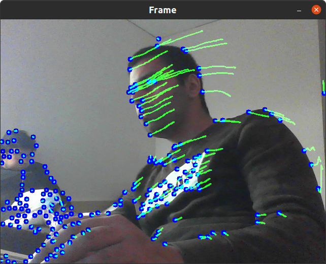

# Practical Assignment 2
**Dealine**: 12.03.2021

Please put your name here:  
**Name:** Muhammad Dorrabb Khan Niazi
## Problem 2.1
### Feature Extraction (Points 30)
1. Fork the current repository
2. Read the OpenCV documentation about the Good-Features-to-Track: [Shi-Tomasi Corner Detector](https://docs.opencv.org/master/d4/d8c/tutorial_py_shi_tomasi.html)  
3. Implement the feature detection and extraction using the ```cv.goodFeaturesToTrack()``` method. Detect features every 300-th frame and draw them on every frame from web-camera. Please extract between 50 and 200 features.

## Problem 2.2
### Sparse Optical Frlow Estimation (Points 50)
1. Read the OpenCV documentation about the Lukas-Kanade method: [Lucas-Kanade Optical Flow](https://docs.opencv.org/master/d4/dee/tutorial_optical_flow.html)  
2. Implement optical flow estimation using the ``` cv.calcOpticalFlowPyrLK()``` method. Calculate Optical Flow between every subsequent 2 frames from web-camera using the features achieved in Problem 2.1.
3. The features are newly detected every 300th frames, _i.e._ approximately once in every 10 seconds. In between the features location at the image will not change.

## Problem 2.3
### Optical Flow Visualization (Points 20)
1. Visualize the Optical flow, using the displacement vectors calculated in Problem 2.2. For this use the OpenCV [drawing functions](https://docs.opencv.org/2.4/modules/core/doc/drawing_functions.html). 
2. Now please move the detected features from Problem 2.1 by the displacement vectors alculated in Problem 2.2 and draw them with the new position in every frame from web-camera. If this is implemented correctly, the features will move with the moving objects in your video stream.

Output when I move myself a bit:


### Note
Please do not copy-paste the example code from the OpenCV documentation, but try to understand the example code and implement the solution to the problem by yourself.

## Submission
Please submit the assignment by making a pull request.
**Important** : Please make sure that
- No _extra files_ are submitted (except those, which were mentioned in the assignment)
- The changes were made _only_ in those files where you were asked to write your code
- The Continiouse Integration system (appVeyor) can build the submitted code
- The rendered images are also submitted in the folder "renders" 

